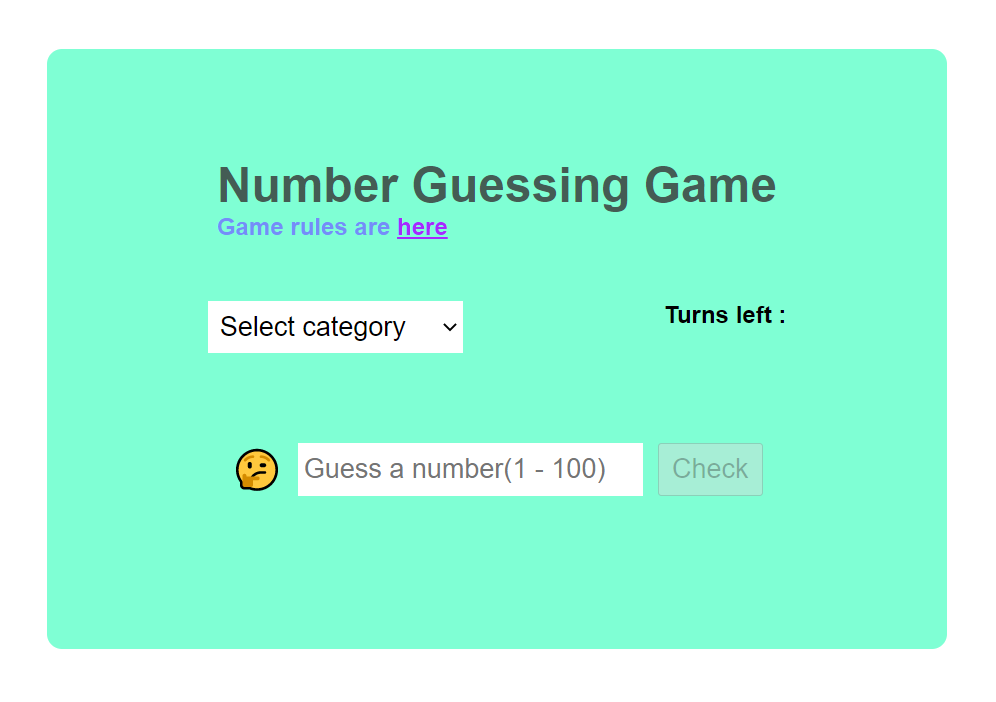

# Number Guessing Game

This is a simple number guessing game, created using HTML, CSS and JavaScript, in which you will have to guess the number, randomly picked by computer between 1 - 100.
If you guess it wrong, machine will give you a hint accordingly, to goes up or come down.

# How it works?

- First you have to select one of the three categories, i.e Easy, Medium, or Hard.
- If you select "Easy", you will have 7 chance to guess the number correct.
- If you select "Medium"  you will have 5 turns 
- if you select "Hard" you will have 3 chances to guess.

# Game Screenshot

